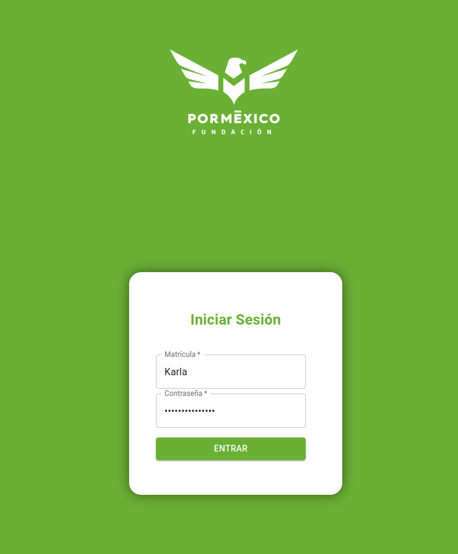

# 1. manual de usuario para el uso de Incidentia

# 2. Indice

- [1. manual de usuario para el uso de Incidentia](#1-manual-de-usuario-para-el-uso-de-incidentia)
- [2. Indice](#2-indice)
- [3. Introducción](#3-introducción)
- [4. Login](#4-login)
- [5. Registro](#5-registro)
- [6. Navegación](#6-navegación)
  - [6.1. Página](#61-página)
  - [6.2. Vistas/items](#62-vistasitems)
  - [6.3. Menú de usuario](#63-menú-de-usuario)
    - [6.3.1. Logout/Cerrar sesión](#631-logoutcerrar-sesión)
- [7. Tableros](#7-tableros)
- [8. Reportes](#8-reportes)
  - [8.1. Actualizar estatus](#81-actualizar-estatus)
  - [8.2. Detalles](#82-detalles)
    - [8.2.1. Comentarios](#821-comentarios)
- [9. reportes Archivados](#9-reportes-archivados)
- [10. Chartpages/resumen semanal](#10-chartpagesresumen-semanal)
- [11. Aulas](#11-aulas)
- [12. Exportar la información](#12-exportar-la-información)

# 3. Introducción

Incidentia es un sistema administrador de reportes. 
El sistema esta diseñado para uso con Fundación Por Mexico, donde puedes reportar ocurrencias en ciertas aulas o accidentes ocurridos.

El propósito del sistema es poder controlar y dar seguimiento a las necesidades que se presenten del día al día. 

La version de pruebas se puede ver por tiempo limitado [aquí](https://139-144-31-25.ip.linodeusercontent.com/).

# 4. Login

Al entrar al sistema, vas a ver una pagina de login:

Si cuentas con un usuario, puedes ingresar tus credenciales y presionar en Entrar. (Por accesibilidad, Enter no sirve).

Si no cuentas con un usuario, debes de pedir a un administrador que cree un usuario por ti.

> Contacta a un administrador para que te genere tus credenciales.

# 5. Registro

> ATENCIÓN: Solo los usuarios con roles avanzados van a poder crear o remover usuarios.

Para registrarte como un nuevo usuario, vas a tener que llenar los siguientes datos:

> NOTA: La matricula es algo que debe de ser único en el sistema, y vas a usar como login. 

> NOTA 2: La contraseña tiene que contar con un mínimo de 8 caracteres, Mínimo una mayúscula, mínimo un numero, y mínimo un carácter especial (`!@#$%^&*.-_`). 

> NOTA 3: una vez asignada la contraseña no la vas a poder volver a ver. Asegúrate de anotarla en algún lado. 

Dependiendo del Rol que elijas van a ser las opciones que tienes disponibles. 

para ver a los usuarios registrados puedes como administrador verlos en la pantalla de Coordinadores:

# 6. Navegación

Para poder navegar por la aplicación, necesitas conocer sus componentes. 

La parte central de la pantalla siempre va  a mostrar el contenido actual. Si necesitas cambiar el contenido, puedes cambiar la pantalla con el navegador encontrado a la izquierda.

## 6.1. Página

En la parte superior izquierda puedes visualizar en la página que te encentras actualmente, asi como esconder o mostrar las leyendas de las vistas.

## 6.2. Vistas/items

En esta sección puedes cambiar entre las páginas.

El menu de los coordinadores se ve de esta forma:

## 6.3. Menú de usuario

En esta sección puedes cambiar entre vista obscura y vista clara. para poder cambiar, solo es necesario presionar en el sol. 

### 6.3.1. Logout/Cerrar sesión

Puedes también hacer logout presionando en tu nombre:

y luego presionando en Cerrar sesión

# 7. Tableros

> Nota: tableros solo esta disponible para coordinadores **Nacionales** o **Ejecutivos**

Después de hacer login, vas a ser redireccionado al Dashboard. En muchas casos no es necesario hacer login si ya habías hecho login previamente. 

El tablero se ve de la siguiente manera:

En esta vista, puedes ver un resumen gráfico del estado de los tickets. 

# 8. Reportes

La vista de reportes te va a permitir visualizar los reportes que has generado. Si eres un usuario con privilegios avanzados, vas a poder ver reportes hechos por mas personas.

La vista te va a permitir Crear un nuevo reporte, exportar los reportes a excel, y filtrar. 

De igual forma, en caso de que hayan muchos reportes, puedes cambiar la cantidad de reportes que quieres ver al mismo tiempo y cambiar de pagina haciendo click en la pagina deseada.

Los reportes te van a dar la opción de adicionalmente actualizar el estatus y ver el reporte.

## 8.1. Actualizar estatus

Cuando tu reporte haya sido completado, o no se pueda resolver, puedes cambiar el estatus del reporte.

Al presionar en completado, te va a pedir información extra:

A continuación puedes describir si el reporte fue completado con una solución o no.

En cualquier caso puedes agregar un comentario describiendo el proceso, y si fue satisfactorio y porque. 

Al presionar guardar, te va a preguntar si deseas continuar. Puedes presionar continuar.

> ATENCIÓN: Al completar un reporte, se pierde la funcionalidad de edición. 
> Si quieres modificar el reporte, hazlo antes de cambiar el estatus. 

## 8.2. Detalles

Al presionar en VER REPORTE, te va a abrir los detalles del reporte.

en esta sección puedes ver los datos del reporte, asi como los comentarios que se han agregado al reporte.

para agregar un comentario al reporte, presiona en AGREGAR SEGUIMIENTO

### 8.2.1. Comentarios

en esta sección puedes escribir un comentario de no menos de 20 caracteres. 

Al terminar, puedes presionar GUARDAR COMENTARIO. El comentario se agregara al reporte. 

Si te equivocaste puedes editar tu comentario presionando el lápiz de tu comentario. 

# 9. reportes Archivados

En esta vista puedes ver todos los reportes y su resolución. 

en la parte superior derecha puedes exportar a excel todos los datos.

La información que se muestra por reporte es todo el resumen que ocurrió. No hay una vista expandida.

# 10. Chartpages/resumen semanal

En esta sección puedes ver los datos y reportes sobre los tickets que has generado.

# 11. Aulas

> ATENCIÓN: esta funcionalidad es solo para coordinadores

Para ver el estado de las aulas, puedes entrar a la pagina de aulas. 

En esta pagina encontraras todas las aulas, con un resumen de cantidad de reportes y reportes archivados. 

Al presionar ver, se va a agregar un filtro por aula. 

# 12. Exportar la información

Todas las paginas cuentan con un botón de exportar

al precionar el boton, se va a descargar un archivo csv, que lo puedes abrir con software como LibreOffice o Excel. 

CSV incluye formas fácil de abrirlo con código, por lo que fue elegido encima .xlsx. 

para conocer mas sobre csv y sus multiples usos, puedes [precionar aqui](https://es.wikipedia.org/wiki/Valores_separados_por_comas)