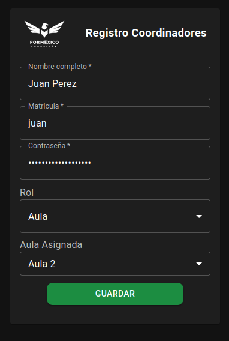
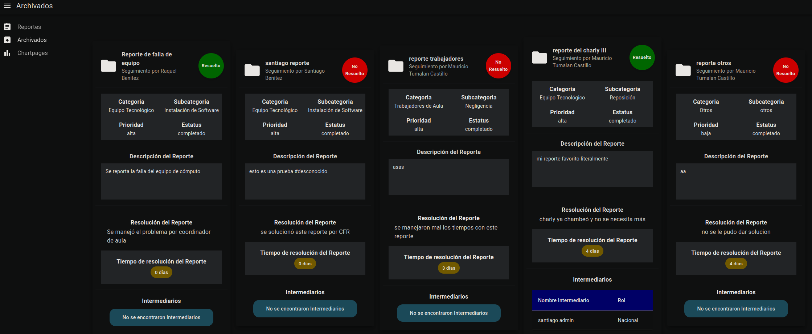

# 1. manual de usuario para el uso de Incidentia

# 2. Indice

- [1. manual de usuario para el uso de Incidentia](#1-manual-de-usuario-para-el-uso-de-incidentia)
- [2. Indice](#2-indice)
- [3. Introducción](#3-introducción)
- [4. Login](#4-login)
- [5. Registro](#5-registro)
- [6. Dashboard](#6-dashboard)
  - [6.1. Página](#61-página)
  - [6.2. Vistas/items](#62-vistasitems)
  - [6.3. Menú de usuario](#63-menú-de-usuario)
    - [6.3.1. Logout/Cerrar sesión](#631-logoutcerrar-sesión)
- [7. Reportes](#7-reportes)
  - [7.1. Actualizar estatus](#71-actualizar-estatus)
  - [7.2. Detalles](#72-detalles)
    - [7.2.1. Comentarios](#721-comentarios)
- [8. reportes Archivados](#8-reportes-archivados)
- [9. Chartpages/resumen semanal](#9-chartpagesresumen-semanal)

# 3. Introducción

Incidentia es un sistema administrador de reportes. 
El sistema esta diseñado para uso con Fundación Por Mexico, donde puedes reportar ocurrencias en ciertas aulas o accidentes ocurridos.

El propósito del sistema es poder controlar y dar seguimiento a las necesidades que se presenten del día al día. 

La version de pruebas se puede ver por tiempo limitado [aquí](https://139-144-31-25.ip.linodeusercontent.com/).

# 4. Login

Al entrar al sistema, vas a ver una pagina de login:

Si cuentas con un usuario, puedes ingresar tus credenciales y presionar en Entrar. (Por accesibilidad, Enter no sirve).

Si no cuentas con un usuario, puedes presionar en Registrarse. Esto te redirigirá a otra pagina donde puedes crear un nuevo usuario. 

# 5. Registro

Para registrarte como un nuevo usuario, vas a tener que llenar los siguientes datos:

> NOTA: La matricula es algo que debe de ser único en el sistema, y vas a usar como login. 

> NOTA 2: La contraseña tiene que contar con un mínimo de 8 caracteres, Mínimo una mayúscula, mínimo un numero, y mínimo un carácter especial (`!@#$%^&*.`). 

Dependiendo del Rol que elijas van a ser las opciones que tienes disponibles. 

Después de llenarlo, debe de verse asi:

Al dar click en el botón de REGISTRARSE, te va a regresar a la pagina de login. Agrega la matrícula y contraseña que acabas

# 6. Dashboard

Después de hacer login, vas a ser redireccionado al Dashboard. En muchas casos no es necesario hacer login si ya habías hecho login previamente. 

El Dashboard se ve de la siguiente manera:

En la parte central puedes ver la pantalla actual, este ligar es donde vas a pasar la mayor parte del tiempo. Si no cuentas con tickets, puedes generar uno presionando el botón verde. 

## 6.1. Página

En la parte superior izquierda puedes visualizar en la página que te encentras actualmente, asi como esconder o mostrar las leyendas de las vistas.

## 6.2. Vistas/items

En esta sección puedes cambiar entre las páginas.

## 6.3. Menú de usuario

En esta sección puedes cambiar entre vista obscura y vista clara. para poder cambiar, solo es necesario presionar en el sol. 

### 6.3.1. Logout/Cerrar sesión

Puedes también hacer logout presionando en tu nombre:

y luego presionando en Cerrar sesión

# 7. Reportes

La vista de reportes te va a permitir visualizar los reportes que has generado. Si eres un usuario con privilegios avanzados, vas a poder ver reportes hechos por mas personas.

La vista te va a permitir Crear un nuevo reporte, exportar los reportes a excel, y filtrar. 

De igual forma, en caso de que hayan muchos reportes, puedes cambiar la cantidad de reportes que quieres ver al mismo tiempo y cambiar de pagina haciendo click en la pagina deseada.

Los reportes te van a dar la opción de adicionalmente actualizar el estatus y ver el reporte.

## 7.1. Actualizar estatus

Cuando tu reporte haya sido completado, o no se pueda resolver, puedes cambiar el estatus del reporte.

Al presionar en completado, te va a pedir información extra:

A continuación puedes describir si el reporte fue completado con una solución o no.

En cualquier caso puedes agregar un comentario describiendo el proceso, y si fue satisfactorio y porque. 

Al presionar guardar, te va a preguntar si deseas continuar. Puedes presionar continuar.

> ATENCIÓN: Al completar un reporte, se pierde la funcionalidad de edición. 
> Si quieres modificar el reporte, hazlo antes de cambiar el estatus. 

## 7.2. Detalles

Al presionar en VER REPORTE, te va a abrir los detalles del reporte.

en esta sección puedes ver los datos del reporte, asi como los comentarios que se han agregado al reporte.

para agregar un comentario al reporte, presiona en AGREGAR SEGUIMIENTO

### 7.2.1. Comentarios

en esta sección puedes escribir un comentario de no menos de 20 caracteres. 

Al terminar, puedes presionar GUARDAR COMENTARIO. El comentario se agregara al reporte. 

Si te equivocaste puedes editar tu comentario presionando el lápiz de tu comentario. 

# 8. reportes Archivados

En esta vista puedes ver todos los reportes y su resolución. 

en la parte superior derecha puedes exportar a excel todos los datos.

La información que se muestra por reporte es todo el resumen que ocurrió. No hay una vista expandida.

# 9. Chartpages/resumen semanal

En esta sección puedes ver los datos y reportes sobre los tickets que has generado.
