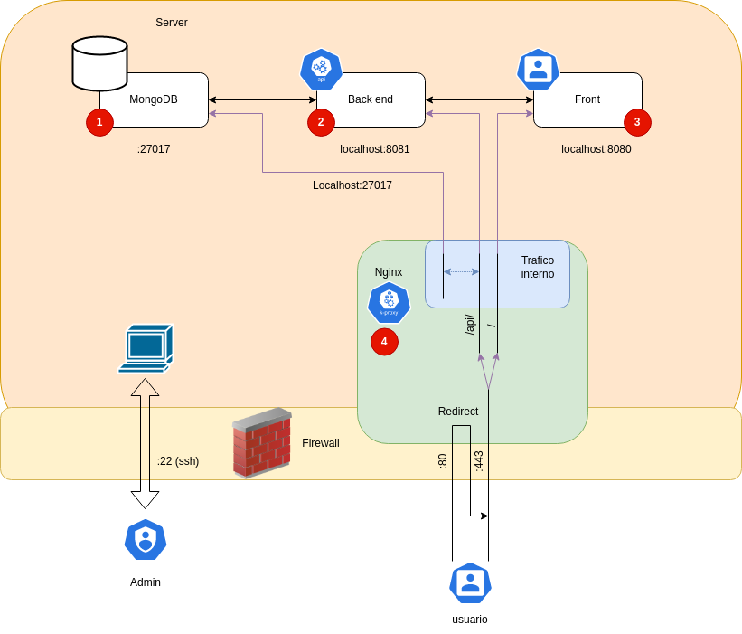

# 1. SAW

El propósito de este documento es informar sobre como sirve el sistema de Incidentia.

# 2. Indice

- [1. SAW](#1-saw)
- [2. Indice](#2-indice)
- [3. Introducción](#3-introducción)
  - [3.1. Usuario](#31-usuario)
    - [3.1.1. Usuarios de Aula](#311-usuarios-de-aula)
    - [3.1.2. Usuarios Nacionales](#312-usuarios-nacionales)
    - [3.1.3. Usuarios Ejecutivos](#313-usuarios-ejecutivos)
  - [3.2. Front end](#32-front-end)
  - [3.3. Back end](#33-back-end)
  - [3.4. DB](#34-db)
- [4. Diseño](#4-diseño)
  - [4.1. Arquitectura del sistema](#41-arquitectura-del-sistema)
  - [4.2. Como sirve una petición](#42-como-sirve-una-petición)
  - [4.3. Elementos del front end](#43-elementos-del-front-end)
  - [4.4. Elementos del back end](#44-elementos-del-back-end)
  - [4.5. Gráficas](#45-gráficas)
- [5. Entorno de ejecución](#5-entorno-de-ejecución)
  - [5.1. Cosas que se necesitan modificar del prototipo](#51-cosas-que-se-necesitan-modificar-del-prototipo)
  - [5.2. Consideraciones para futuro](#52-consideraciones-para-futuro)

# 3. Introducción

Incidentia esta separado en 4 diferentes areas:

- Usuario
- Front end
- Back end
- BD

Cada area procesa y se encarga de un dato especifico.

## 3.1. Usuario

Es la persona que esta usando el sistema. Incidentia reconoce 3 tipos de usuarios:

1. Aula
2. Nacional 
3. Ejecutivo

### 3.1.1. Usuarios de Aula

El rol de los usuarios de Aula es poder generar reportes y ver el seguimiento de sus reportes. 

Estos usuarios no cuentan con permisos para ver mas que sus propios reportes hechos, y agregar comentarios al propio.

### 3.1.2. Usuarios Nacionales

El propósito de estos usuarios es administrar Aulas. Ellos son los que ven y actualizan los estatus de los reportes generados. 

A su vez, pueden ver todos los reportes generados

### 3.1.3. Usuarios Ejecutivos

Estos usuarios son los que le pertenecen a roles administrativos. Pueden generar y ver los reportes que sean necesarios.

## 3.2. Front end

Se le define front end a todo el software que interactué con el usuario. Cuanta con una interfaz visual. 

## 3.3. Back end

El back end es lo que procesa los datos y genera lo necesario para poder presentar los datos de la forma deseada. no cuenta con interfaz visual.

## 3.4. DB

La DB sobre la que Incidentia esta construida es MongoDB. Es el lugar donde se guardan todos los datos. El front end no cuenta con comunicación directa. 

# 4. Diseño

Para Incidentia, se asume que la ejecución del sistema va a ser contenida en una sola instancia. Esta instancia comparte recursos con todos los documentos. En caso de requerir separar los recursos en varios servidores, es necesario cambiar la configuración de nginx. Sin embargo, el protocolo del backend sirve de forma independiente, haciendo la separación de nodos mas sencilla. 

## 4.1. Arquitectura del sistema

El sistema Incidentia tiene 3 sistemas ejecutándose en paralelo, al igual que nginx, funcionando como el reverse proxy server.

El sistema de incidentia depende al 100% de cada uno de estos sitemas. 

Los sitemas se encuentran ordenados de la siguiente manera:

> Nota: MongoDB se puede encontrar en un servidor externo, y se recomienda para un mejor funcionamiento.

El firewall no permite entradas de ningún lado a excepción de los puertos para http y conexiones a configurar la computadora.

Los servicios se descargan e instalan de github, usando el documento de configuración.

Para poder tener un funcionamiento mas rápido, se usa nginx como provedor de certificados ssl, permitiendo manejar el trafico de forma eficiente, y si se desea, permitir proveer archivos estáticos en un futuro.

## 4.2. Como sirve una petición

Los pasos por los que pasa una petición son los siguientes:

Como se puede observar, una petición inicia en el usuario, donde interactúa con el sistema. A continuación es donde el sistema inicia a interactuar. El front end prepara la petición al backend en formato json, agregando los headers con con el token JWT (sesión) y manda la manda al back end.

El back end procede a pasar por el proceso de AAA (Autenticar, Autorizar y Acontar). Una vez generados los filtros necesarios, se conecta con la BD para completar la petición. Se hace una confirmación de los datos modificados o tomados, y se regresa al usuario en el front.

## 4.3. Elementos del front end

El front end tiene un flujo basado en el dashboard. lo que esto significa es que el usuario puede entrar a cualquier punto sin necesidad de entrar por botones escondidos.

Cada vista se conecta a un endpoint llamado de la misma forma en el backend, donde se cuentan con los elementos necesarios para ver uno, ver todos, editar y borrar.

## 4.4. Elementos del back end

El back end cuenta con una estructura muy similar para todos los endpoints, a excepción del de los tickets que tiene elementos adicionales, el login/autenticación y JWT que se usa para autenticación interna. 

todos los endpoints pasan por el proceso de Autenticación, donde no se confía que el front end o la petición sea legitima. Por esta razón, siempre se filtra todo en el back end, y a su vez, se regresa solo la información que el usuario necesite, nunca mas.

## 4.5. Gráficas

Las gráficas que actualmente estamos usando utilizan el api de MongoDB Atlas. Estas gráficas no son gratuitas pasado una cantidad de almacenamiento, pero pueden ser remplazadas de forma sencilla.

Están por el momento para demostrar un funcionamiento, pero se puede modificar un endpoint en el back-end, cumpliendo con los requisitos de mantener un bajo costo.

# 5. Entorno de ejecución

Por el momento, el entorno de ejecución esta pensada para tener un solo servidor, sin embargo, se puede dockerizar, separar, modificar la arquitectura a como sea necesario para ser escalado.

El servidor requiere:
- Ser un servidor de Ubuntu Linux
- Contar con una conexión con nombre de dominio apuntando a su ip
- Tener una ip estática
- contar con un mínimo de 1Gb de RAM
- Tener al menos 2 threads. 

La escalabilidad de nuestro sistema es de una complejidad O(n), es decir por cada endpoint, se corren las cosas una sola vez, pero no contamos con cache que nos permita generar una complejidad de O(log(n)).

Lo que esto significa es que el sistema puede ser escalado agregando mas maquinas, sin necesidad de manejar herramientas complejas. 

## 5.1. Cosas que se necesitan modificar del prototipo

Para enviar a producción, es necesario modificar lo siguiente:

- Usar pools de mongo db, no crear una conexión cada vez que llega una petición. 
- Agregar compilar y correr para que sea mas optimizado
- Agregar cache de archivos por parte de nginx y su aceleración de transferencia de datos
- Crear una interfaz para IT que permita visualizar los logs de forma mas sencilla
- Agregar protección contra DDOS
- Agregar limites de tiempo para generar nuevos tickets (para evitar spam)
- Agregar alertas automáticas
- Agregar heartbeats y sistemas de monitoreo que reinicien el servidor en caso de que deje de funcionar.

## 5.2. Consideraciones para futuro

Consideramos como equipo que en general el app actual esta muy cerda de poder ser un MVP (Producto mínimo Viable). teniendo en consideración que la instalación es automática, mucha gente puede hacer el setup sin requerir un conocimiento profundo de como usar Linux. 

Sin embargo, creemos que como es un servicio publico, mucha gente va a querer hacer tickets de forma ilimitada o tirar los servidores, por lo que consideramos que es necesario tener algún tipo de prevención contra ello, como solo poder generar 50 tickets en un día.

A su vez, creemos que puede ser buena idea integrarlo con la pagina web ya existente. Lo que esto se refiere, es que para tener una mejor accesibilidad agregar in botón que redirection a incidencias es conveniente.

Un cambio que es conveniente es tener un token para refrescar el login del usuario. Permitiendo que no tengan que ingresar sus credenciales cada hora. Es conveniente que este token utilize la ip, navegador, y otros elementos para que la autenticación no pueda ser robada. 

La ultima consideración importante es el hecho de que el prototipo fue hecho para computadora, no no se escala bien al teléfono móvil. Es muy probable que mucha gente termine usando desde su cell el app, por lo que va a ser necesario adaptar la interfaz. 

